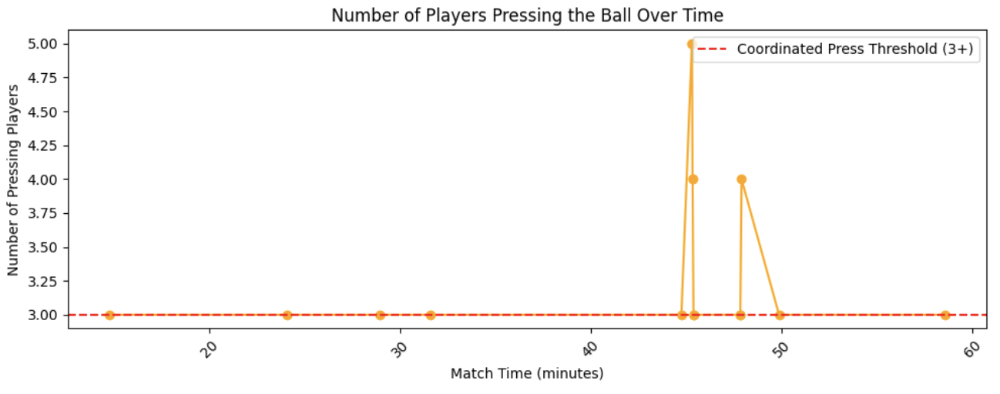
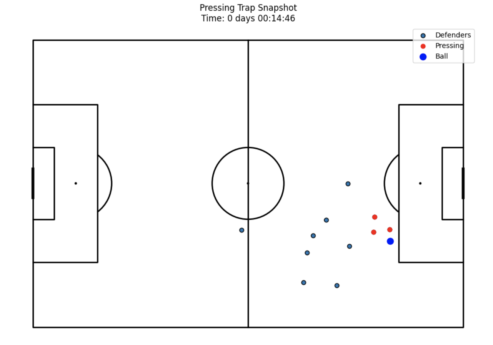
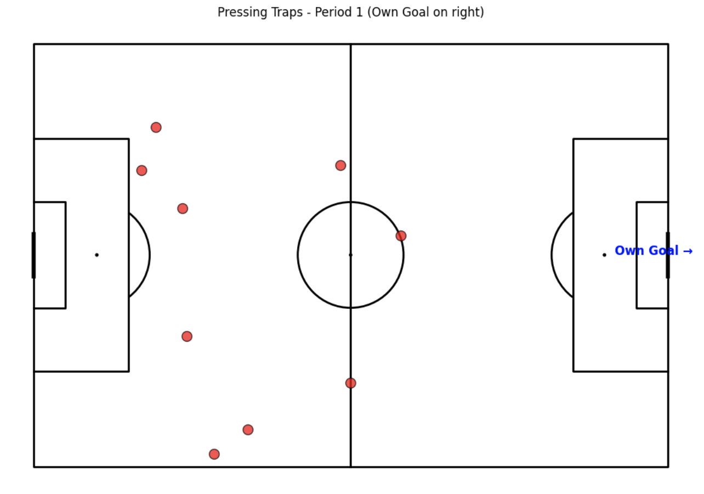
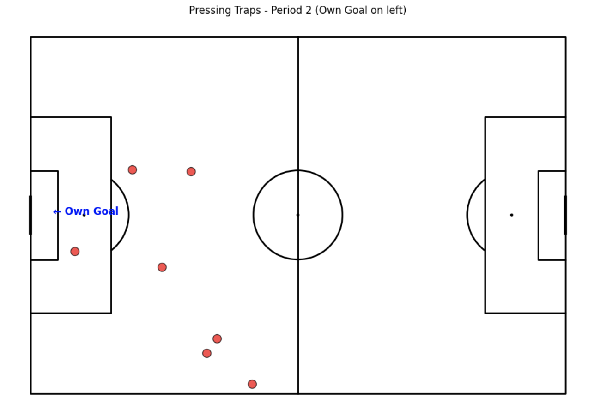

# Are there coordinated pressing traps (e.g., multiple players press simultaneously)?

Reveals if pressing is well-organized or random. Coordinated traps are a sign of tactical discipline, often indicating team training and strategic intent.

---

# 🛠️ What I Did Technically

- Loaded player tracking data and event data from a PostgreSQL database using SQLAlchemy and pandas.
- Calculated the number of our players pressing the ball simultaneously based on:
  - Distance to the ball (≤ 8m)
  - Speed toward the ball (> 2.5 m/s)
- Detected moments where ≥ 3 players press the ball together within a rolling 700ms window.
- Merged trap times with the ball's location.
- Determined own goal direction per half using **goalkeeper average x-position** in the first 5 seconds.
- Adjusted x/y coordinates of pressing traps so that all visuals show **our team attacking left-to-right**.

---

# 📊 What the Output Tells Us

### Pressing Intensity Over Time

- We detected 27 pressing traps.
- They’re spread across both halves but with higher intensity just after the 45th minute.

### Snapshot of One Pressing Trap

- Shows 3 players pressing in sync on the left wing while others cover passing lanes.

### Locations of Pressing Traps

**Period 1**

**Period 2**

- All pressing traps are shown relative to our attack direction (right side).
- Some traps were previously shown outside the pitch due to coordinates > 80 on the Y-axis — this is now fixed.

---

# 📢 Clear Answer

✅ **Yes, there are coordinated pressing traps** in this match.  
Our team exhibits multiple pressing actions where 3+ players press in unison, especially early and mid-way through the match.  
This reflects structured pressing behavior, not random runs at the ball.

---

# 🧰 Could We Go Further?

Yes, if we want to refine or expand:

- Color traps by number of pressers (e.g., red = 3, yellow = 4+, etc.)
- Visualize passes or turnovers before/after pressing traps
- Add opponent position data to evaluate pressure effect
- Calculate team compactness at pressing moments

---
